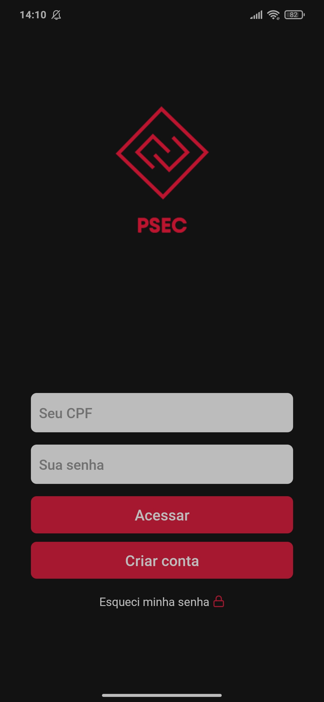
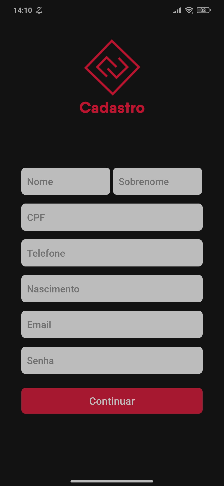
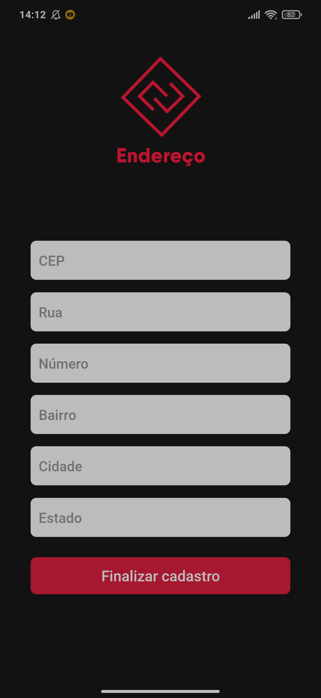
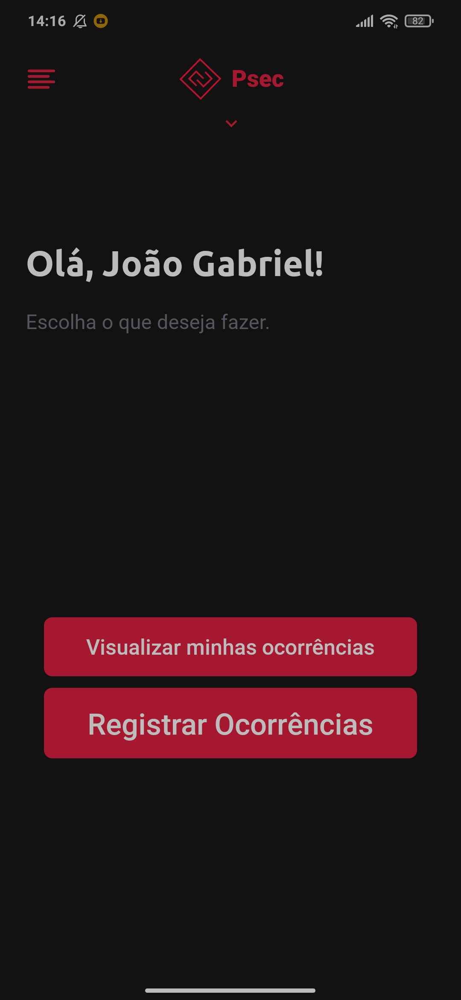
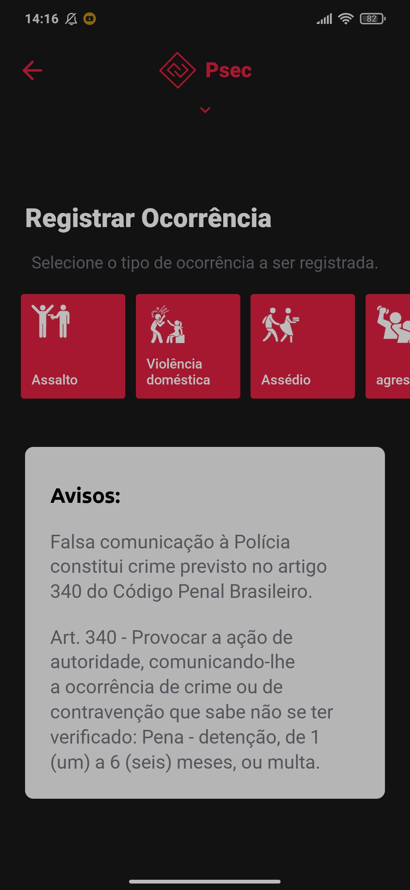
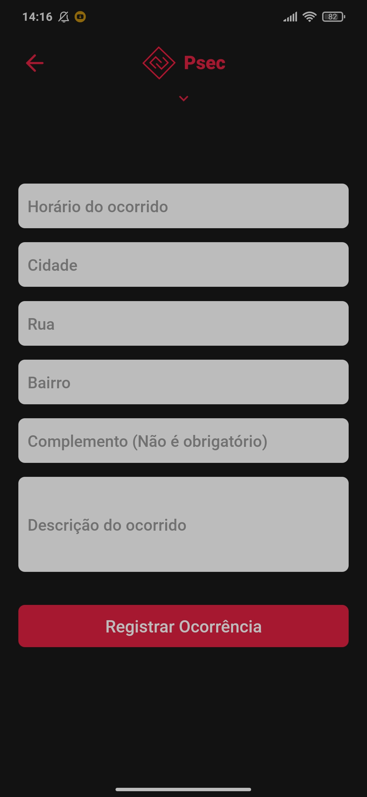
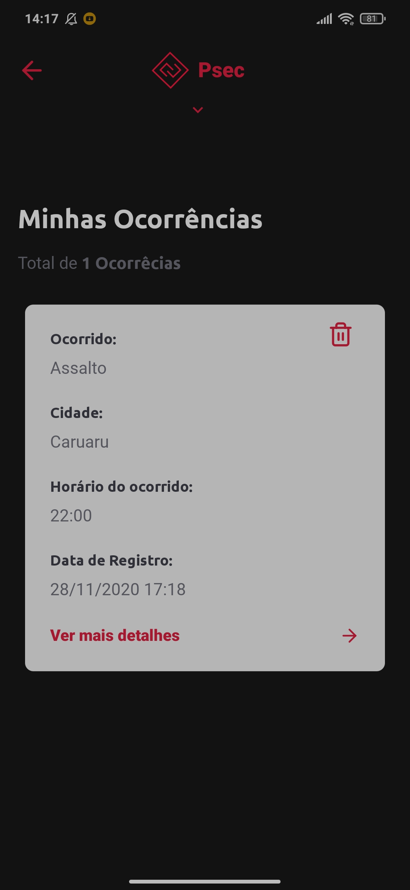
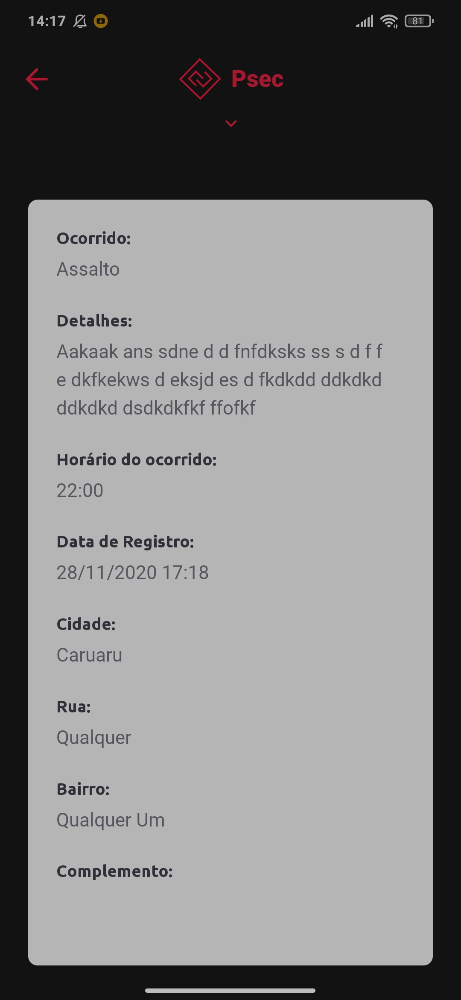

<h1 align="center">
 Trabalho de Desenvolvimento de software
  
 <h3>Data de entrega: 17/06/2020<h3>
  
<h1>

 

 
 
 

## 🚀 Technologies

Tecnologias usadas:

- ✔️ EXPO
- ✔️ React Native
- ✔️ React Hooks
- ✔️ Axios
- ✔️ React Navigation
- ✔️ Lottie
- ✔️ Spring Boot

 

### Instagram: [@tenoriogah](https://www.instagram.com/tenoriogah)
